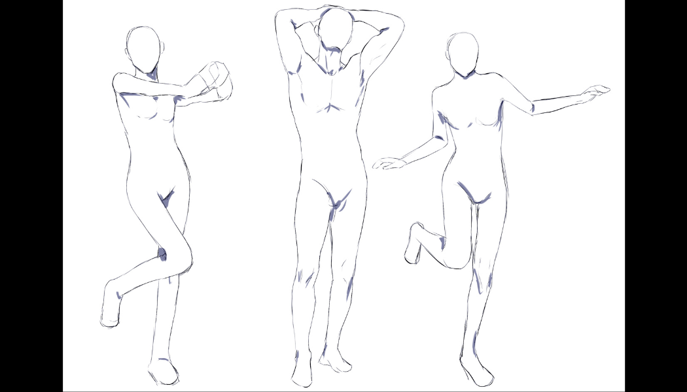
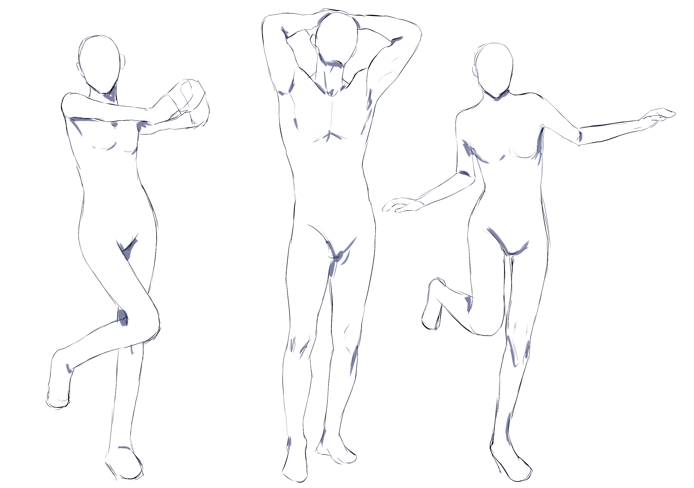

# CSP-00 · 方法总览：先找可控制的起点

来源仅限 CLIP STUDIO TIPS 文章《人体构图》（dayebeeon）。本章是后续章节的入口，不提供另一套人体体系。

## 何时读取

新建人体草稿或面对陌生姿势、尚未决定从哪里起笔时读取。已经有稳定定位稿时不必反复加载。

## 连续讲解

这套方法的核心不是规定唯一的人体公式，而是把复杂身体转换成模型能稳定执行的观察顺序。人物可以长腿、短躯干、小头或长臂，比例由目标角色决定；画法只负责把目标比例拆成可以核对的中线、分界点和简单形状。

开始时先问两个问题：画面中哪个部位最容易确认？哪一条线最能概括整个姿势？起点可以是胸部、腰部、背部或一条贯穿全身的动作线，不必机械地从头画到脚。后续章节会把这个起点展开为比例、关节点、躯干、四肢和线条质量。

这组人物说明同一套观察法可以覆盖不同动作；它不是要求复制人物外形。先看身体整体的倾斜、支撑腿、抬起的肢体和四肢形成的负形。

## 模型执行

1. 读取目标参考图，说明人物的总体倾斜、承重方向和最明显部位。
2. 选择一个起点：胸部、腰部、背部或动作线，只选一个。
3. 转入 CSP-01 或 CSP-05，建立比例中线或动作指南。

## 完成标志

模型能用一句具体描述说明“从哪里起笔、为什么”，并能指出后续需要核对的至少两个关节点；尚未要求画出完整外轮廓。

