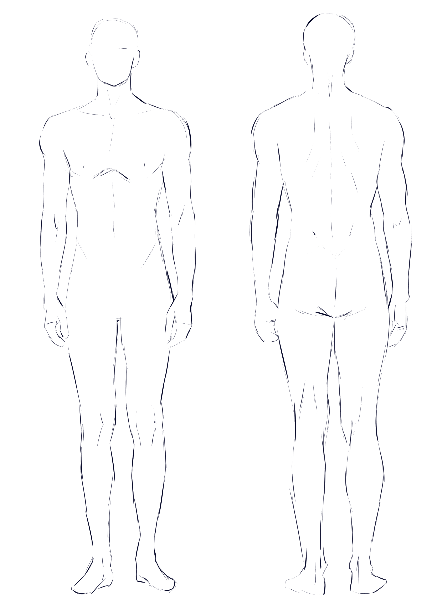
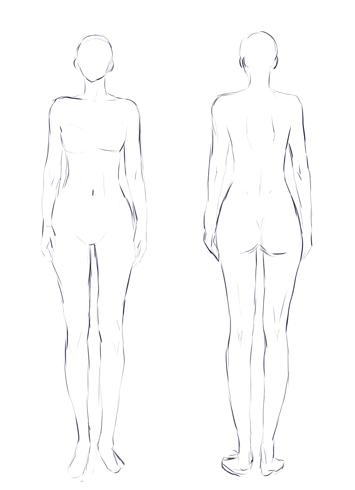
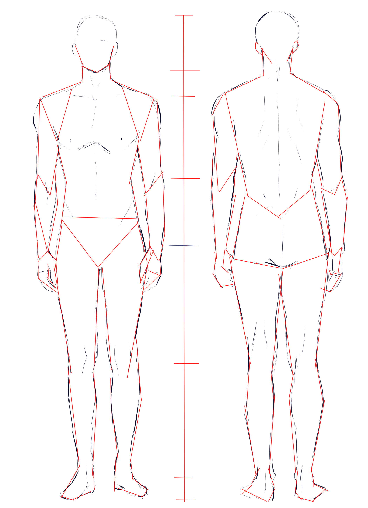
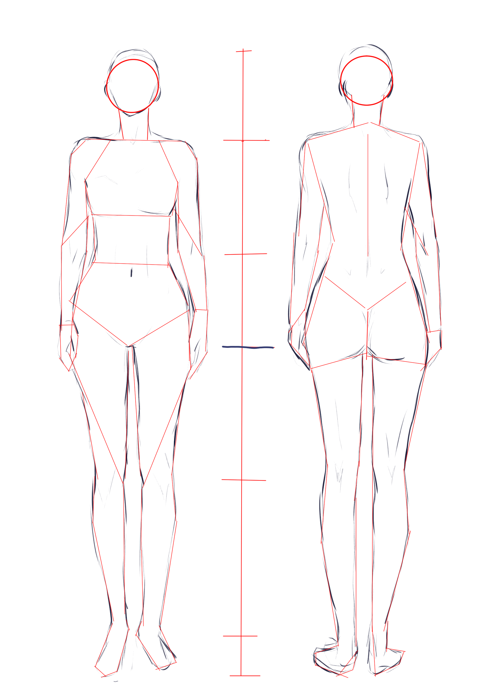

# CSP-01 · 结构：身体类型、比例中线与分界

## 何时读取

用于 1A 整体定位。目标是建立全身尺寸与主要分界，不处理肌肉、衣服和五官。

## 连续讲解

人体比例不是固定数字。先观察目标属于长腿、短躯干、小头、长臂还是其他风格，再画一条代表人物总尺寸与朝向的中线。沿中线标出颈部、肩部、腰部、胯部、膝部和脚部等关键分界。分界的价值是让后续每一段都能相互比较，而不是让人物服从教材示例的默认比例。

先比较男女或不同体型的整体差异，再选择适合当前目标的分法。模型不应把两个示例平均成一个“标准人体”。

接下来把中线作为尺寸尺。标记点只放在会影响后续连接的位置：颈根、肩线、胸腰转换、胯、膝和踝。标记过多会把定位阶段变成细节描摹。

## 模型执行

1. 先写出目标人物的比例特征，不使用“正常人体”这类空泛描述。
2. 画一条贯穿人物的中线或总高基准。
3. 标出颈、肩、腰/胯、膝、踝六类关键位置；不可先画衣服轮廓。
4. 比较头→胯与胯→脚的长度以及左右肩胯倾斜。

## 检查问题

- 中线是否顺着姿态而不是永远垂直？
- 分界是否来自目标参考图？
- 膝和肘是否落在合理的相对位置？
- 缩小后能否看出人物整体高矮和重心？

## 完成标志

中线和分界足以承载关节点与简单形状；如果人物比例仍靠猜，继续本章，不进入四肢轮廓。

