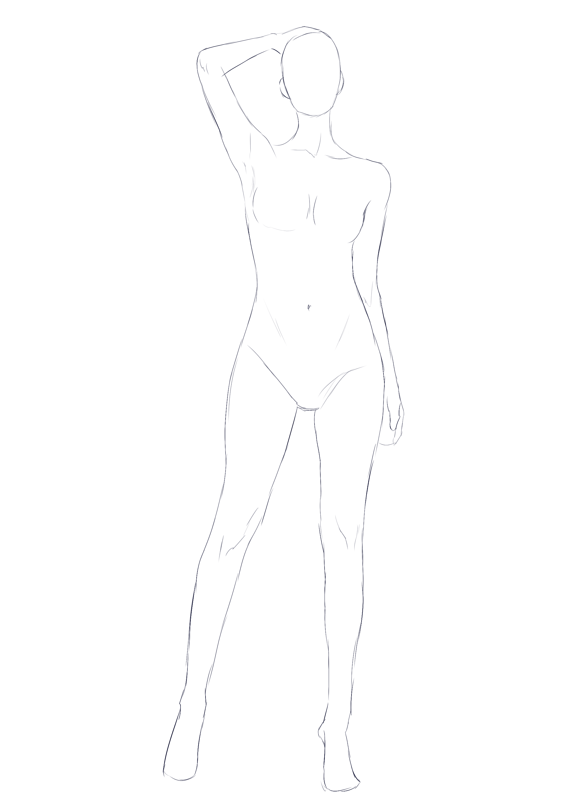
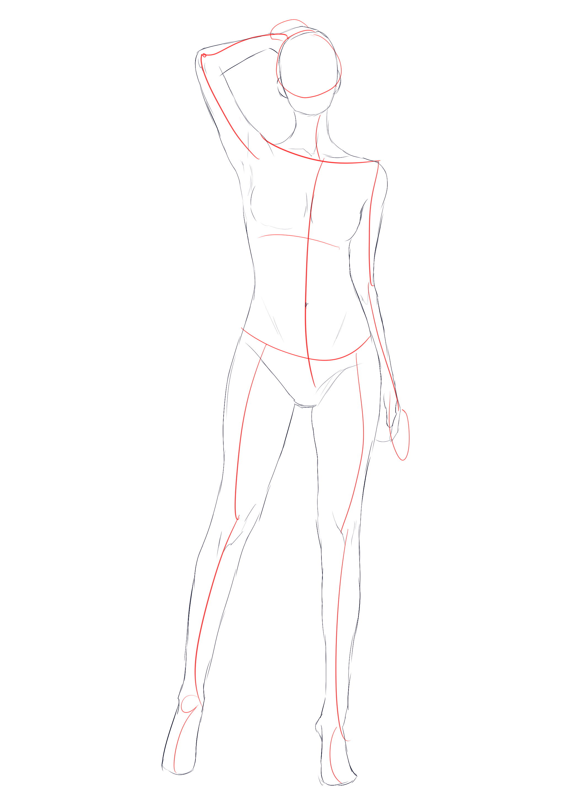
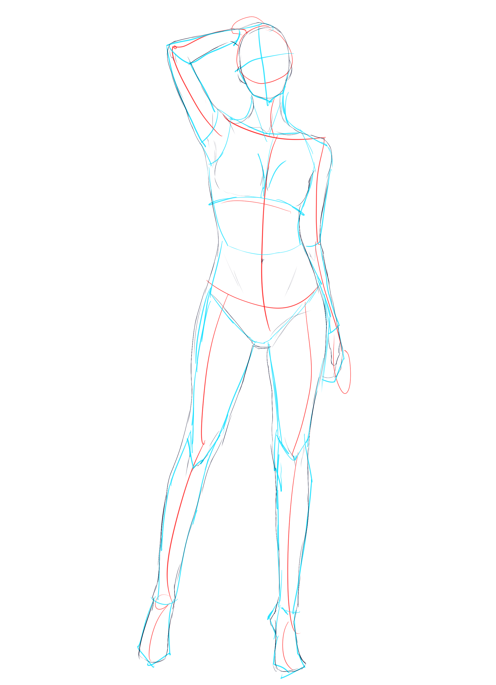
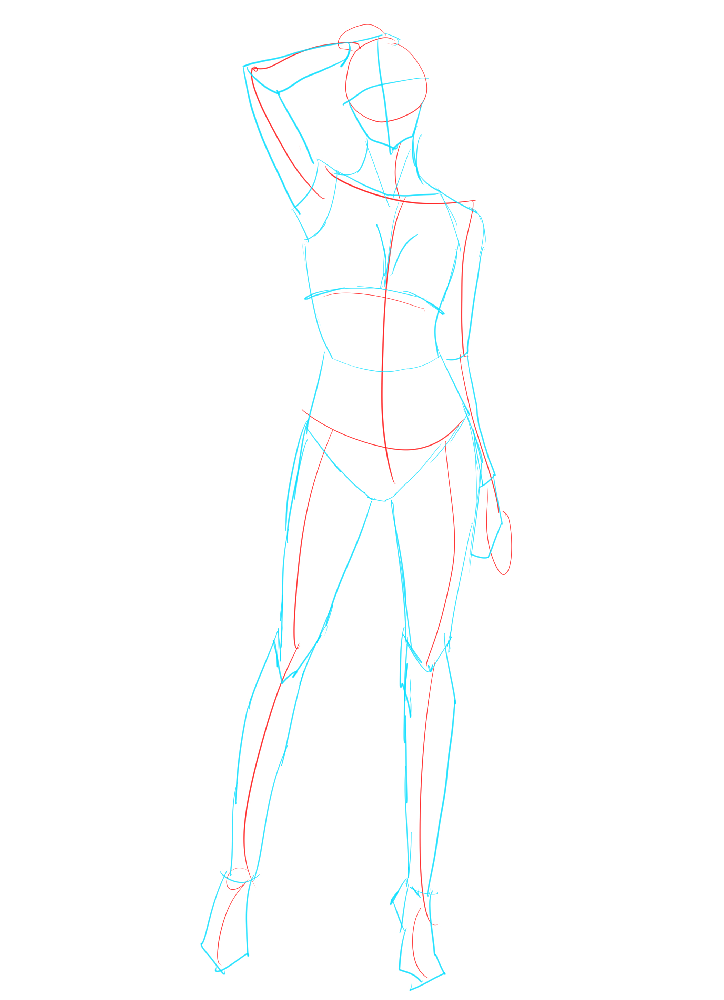
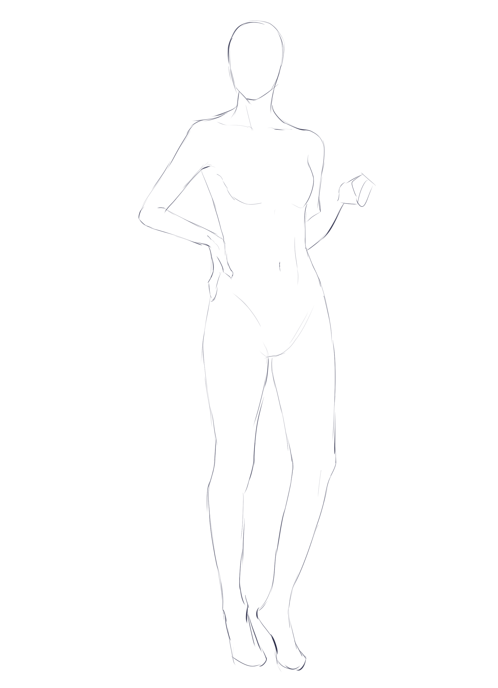
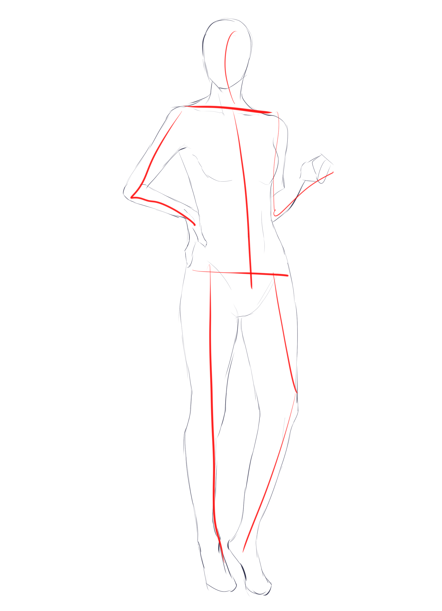
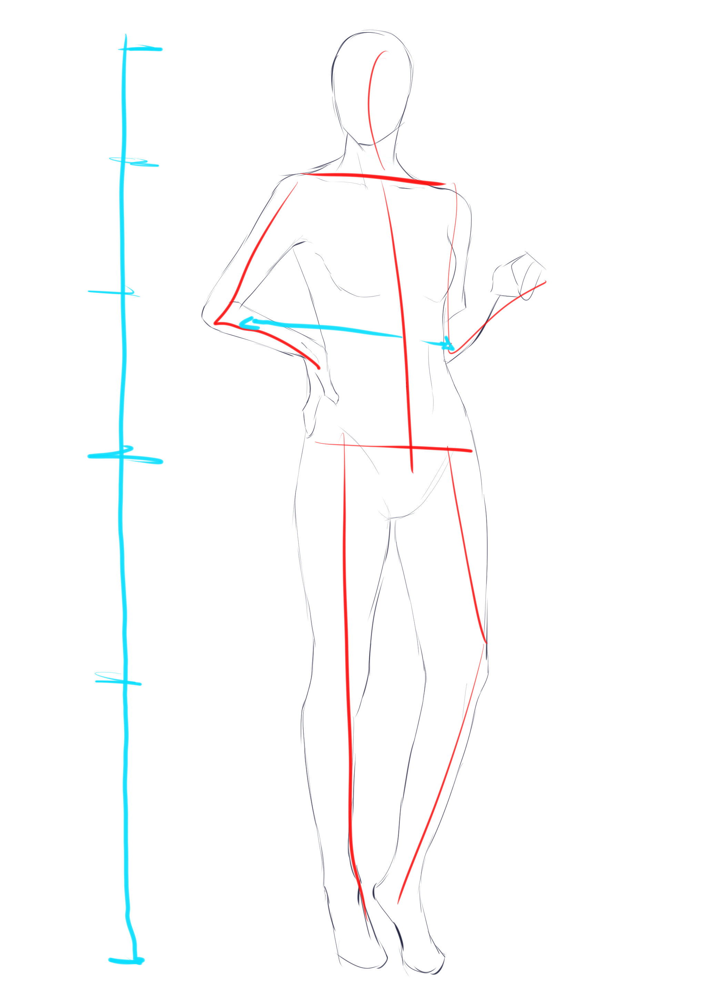

# CSP-02 · 创建参考：从关键点到简单形状

## 何时读取

用于 1A 后半与 1B 前半。已有比例中线，但还没有稳定的躯干和四肢体块时读取。

## 连续讲解

面对参考姿势，先提取头、躯干、手臂和腿的基本方向。选择胸部、腰部或颈部中最容易确认的一点作为局部起点，将手臂和腿概括为接近矩形的长段，将脚概括为三角或楔形。此时线条可以直一些，重点是方向清楚、长度可比、关节可连接。

简单形状不是最终人体，而是对透视和连接的承诺。画完后立即比较弯曲手臂的远近、弯膝的位置和每段肢体长度；偏差应在体块阶段修正。

## 模型执行

1. 从参考图列出头、躯干、上臂、前臂、大腿、小腿、脚的方向。
2. 选择胸、腰或颈中的一个起点。
3. 用直线/矩形连接大肢体，用三角或楔形表示脚。
4. 回看弯曲肢体的前后关系和端点距离，修正后再加曲线。

## 禁止事项

- 不用成品外轮廓覆盖尚未确定的关节点。
- 不把矩形画法当作固定风格；它只服务于当前阶段。
- 不以“看起来像人”代替与目标姿势的比较。

