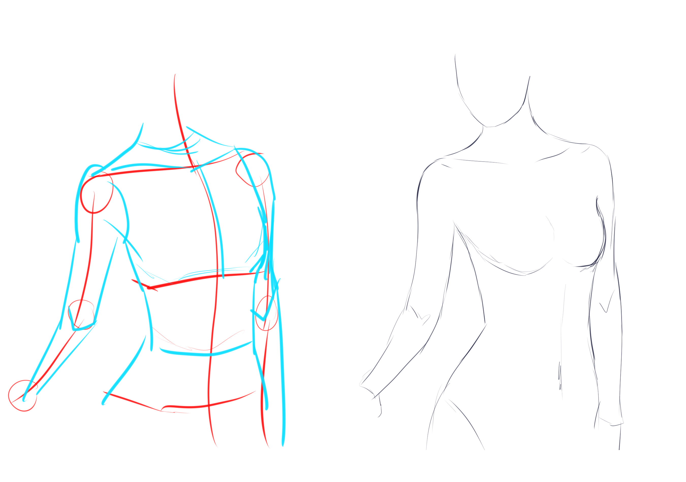
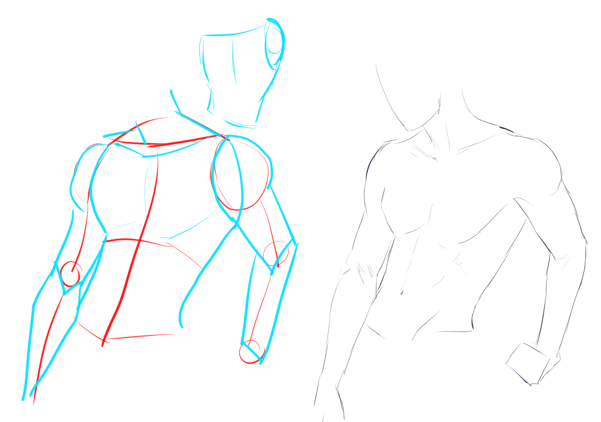

# CSP-03 · 上半身：胸部、肩部与手臂的相互制约

## 何时读取

用于 1B 完整粗稿；肩宽、胸部朝向或手臂长度不稳定时也可在 1C 回读。

## 连续讲解

上半身不能拆成互不相干的胸部和两条手臂。先确定胸部的朝向与宽度，再由胸部决定肩部落点和上臂起点。手臂抬起、交叉或朝向镜头时，胸部可见宽度和肩线都会受到透视影响。

## 模型执行

1. 从中线确定胸部朝向。
2. 放置左右肩点，比较其高度、远近和与颈部的间距。
3. 从肩点连接上臂、肘和手腕；用胸宽校验手臂长度。
4. 最后才补胸部与手臂的柔和外轮廓。

## 检查问题

- 两侧肩点是否属于同一个胸部透视？
- 手臂是否真正连接到肩，而不是贴在躯干边缘？
- 交叉或抬起的手臂有没有明确前后遮挡？

