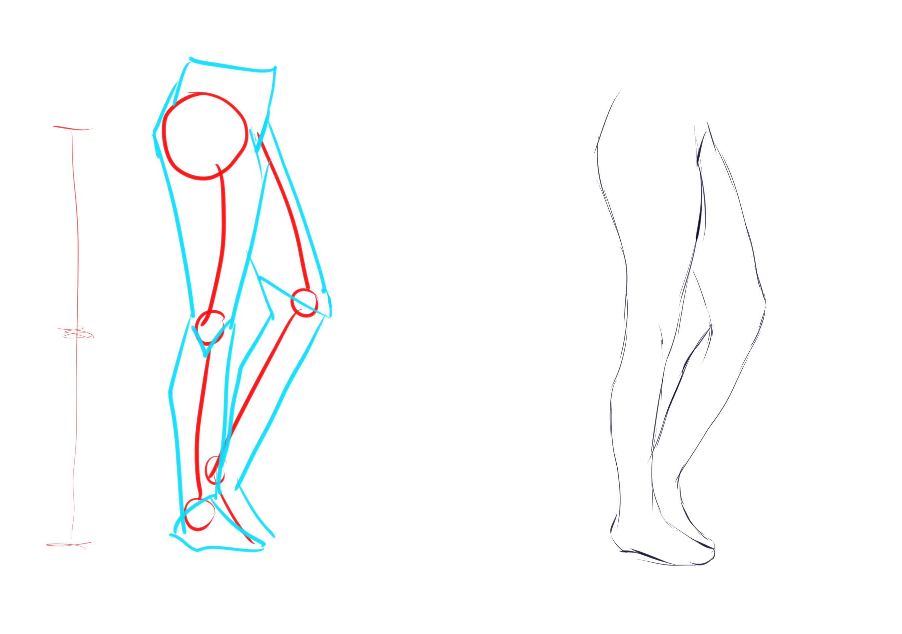
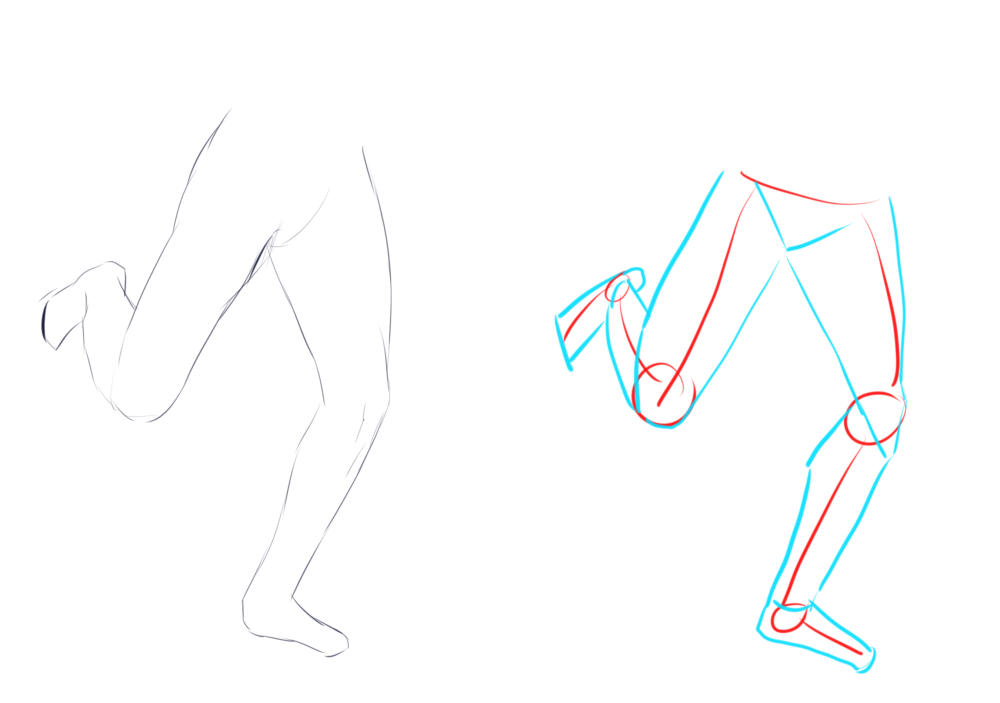

# CSP-04 · 下半身：臀部、膝盖与脚踝的距离链

## 何时读取

用于 1B；腿长、膝盖位置或站姿支撑不稳定时读取。

## 连续讲解

下半身从臀部开始建立。先找臀部/胯部的起点，再分别比较臀部到膝盖、膝盖到脚踝两段距离。教程以“两段大致相近”作为易用的初始比较，但最终长度仍服从目标人物的高矮、腿型和透视。

## 模型执行

1. 标明胯部方向和左右腿起点。
2. 分别放置膝点、踝点和脚端点。
3. 比较两段腿长；透视缩短必须能由朝向解释。
4. 确定承重腿与非承重腿，再补腿部宽窄变化。

## 检查问题

- 膝点是否同时符合腿长和动作？
- 承重脚是否位于重心可落下的位置？
- 左右腿的粗细与缩短是否来自同一视角？

