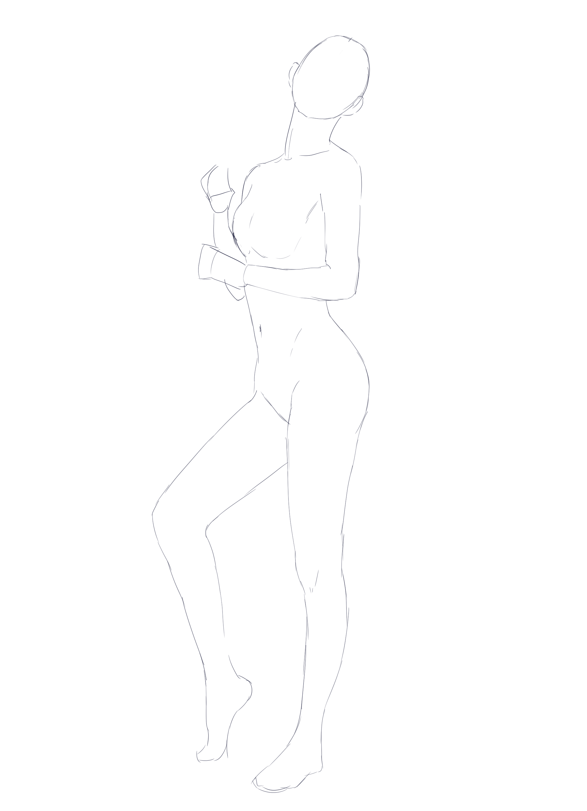
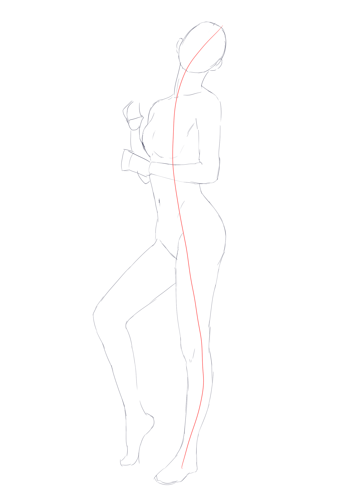
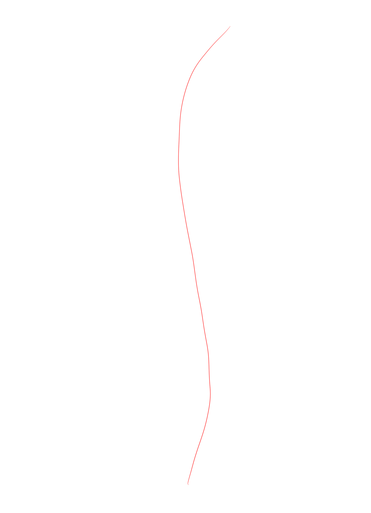
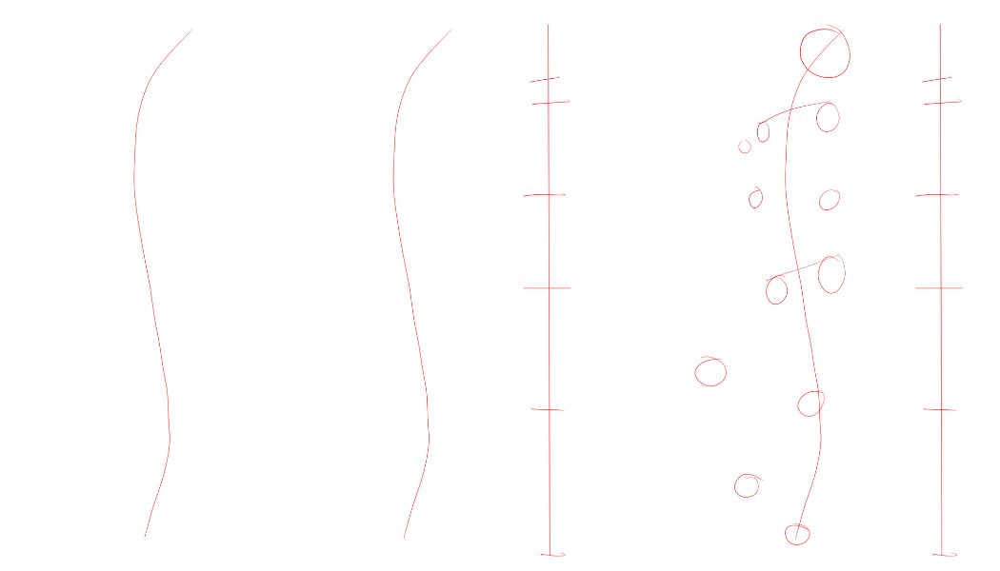
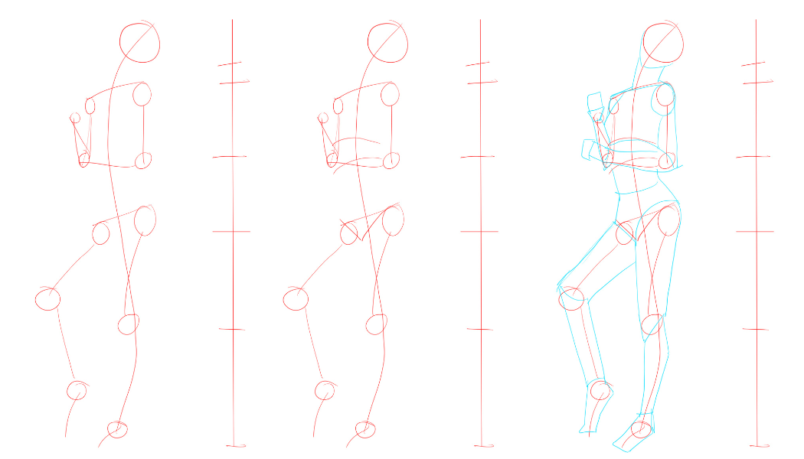
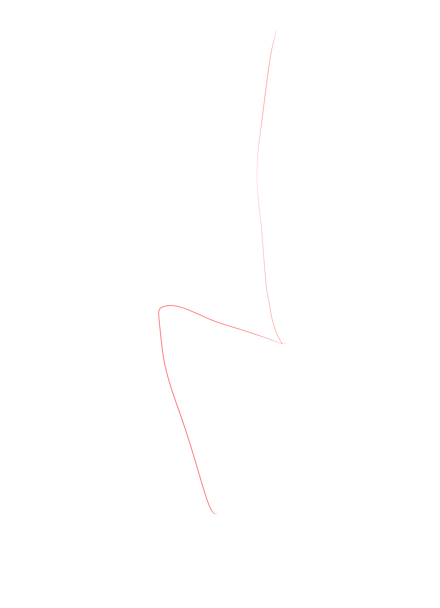
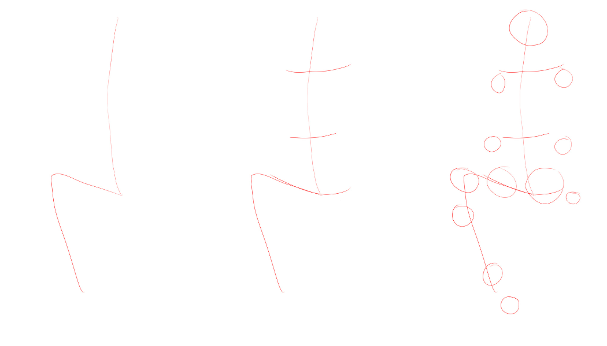
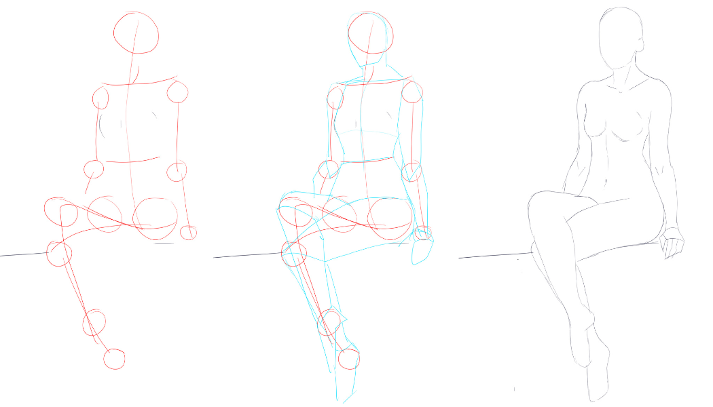

# CSP-05 · 指南：动作基线、参考点与连接

## 何时读取

用于 1A。姿势僵硬、身体各段方向互不相干，或复杂动作不知道如何开始时读取。

## 连续讲解

先用一条穿过身体的线概括动作。它不是严格的脊柱解剖线，而是对姿势弯曲、倾斜和重心的快速说明。根据目标参考，先找到这条基线，再用比例分界确定头、胸/腰、胯和脚的大致位置。

接着标记肩、肘、腕、胯、膝、踝等参考点。点与点之间先用简单线段连接，暂时不追求肌肉外形。只有当动作线、比例线和关节点彼此兼容，才把线段扩展成体块。

坐姿或弯曲动作同样遵循这一顺序：先标明显部位，再标关键点，再连接。不要因为姿势复杂就跳过基线。

## 模型执行

1. 画一条动作基线，表达人物主要弯曲方向。
2. 放置头、肩、胯三个主参考点。
3. 放置肘、腕、膝、踝与脚端点。
4. 用简单线段连接；检查后才扩展为体块。

## 完成标志

隐藏外轮廓后，动作线和关节点仍能读出与目标一致的姿势、重心和四肢方向。

