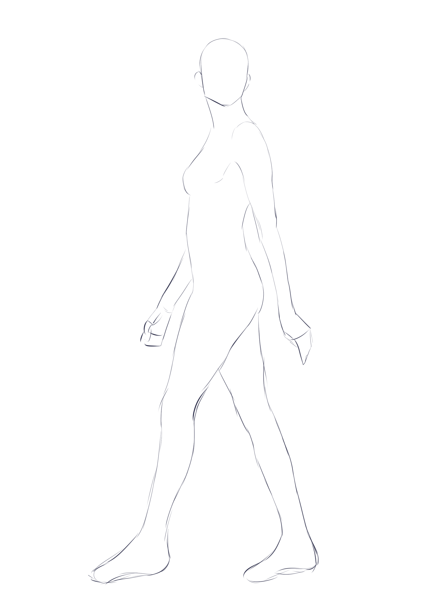
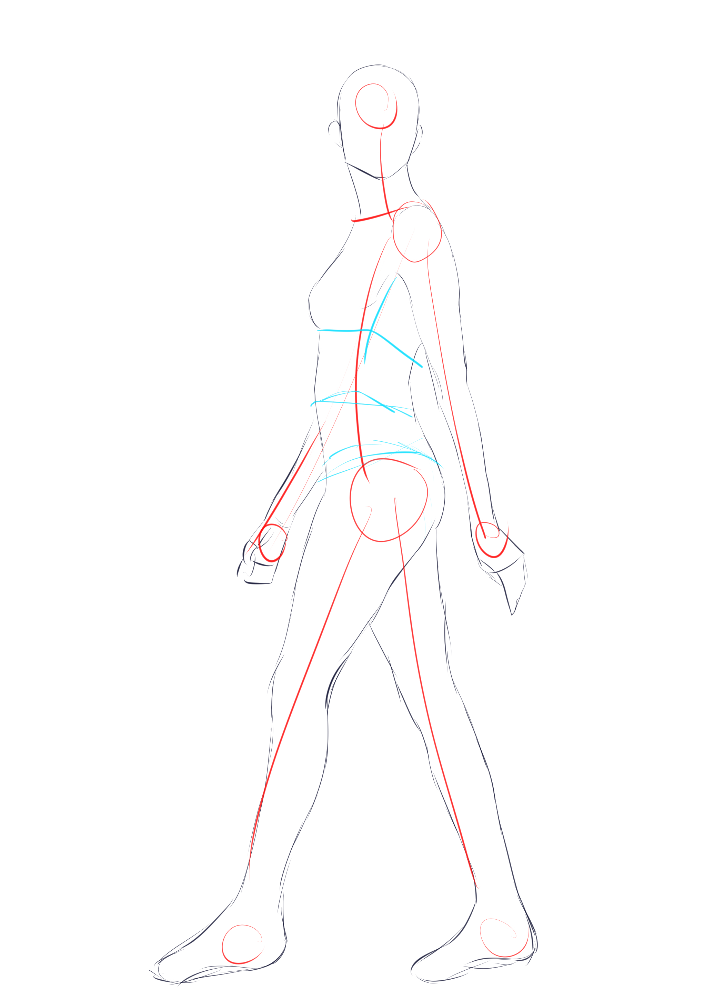
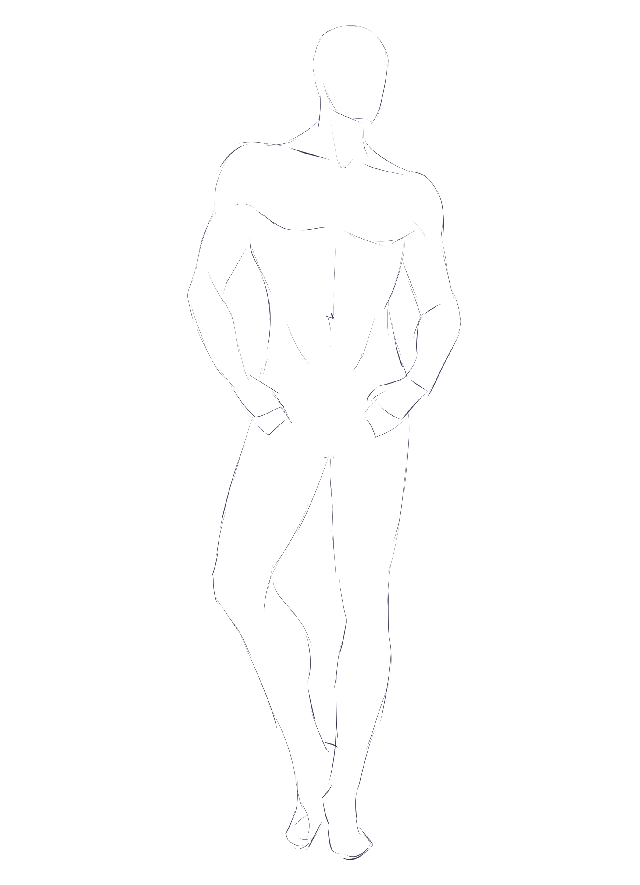
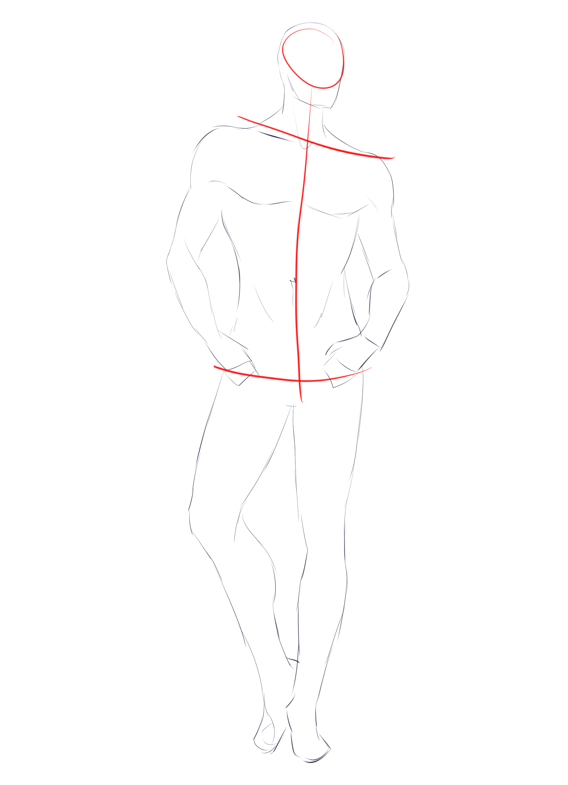
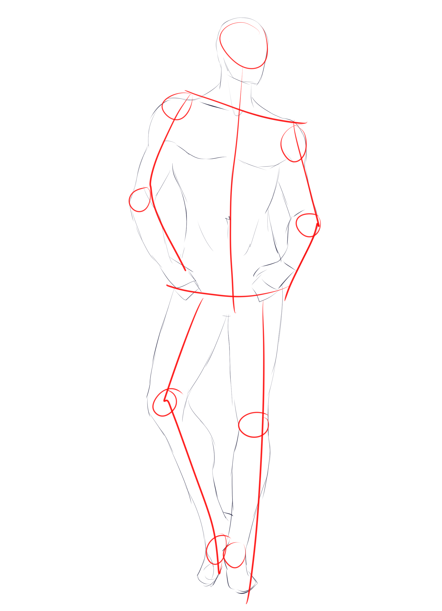
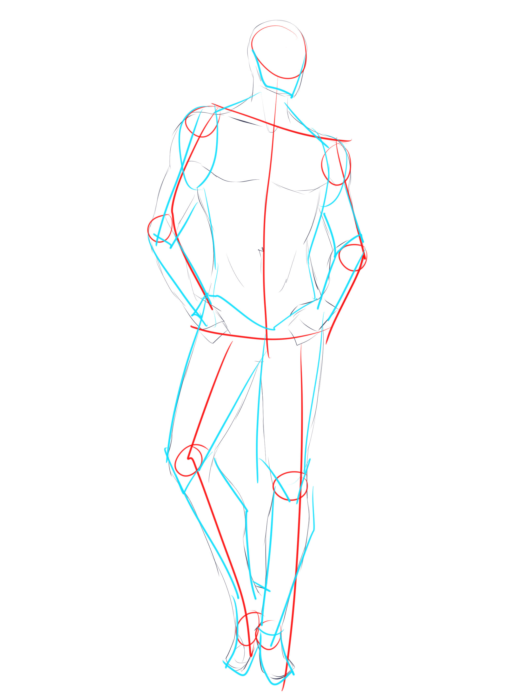
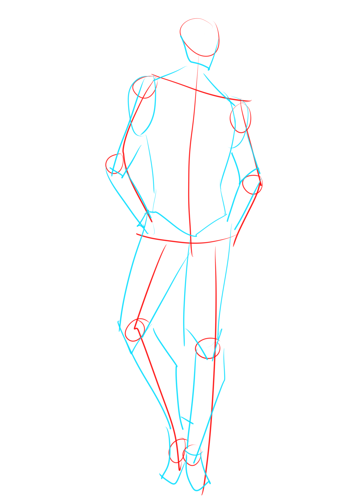

# CSP-06 · 参考练习：把观察过程练成可复用动作

## 何时读取

用于 1A–1B 的快速姿势练习，或模型多次出现“会描述但落笔慢、每次起稿方式不同”的情况。

## 连续讲解

重复练习的目标是缩短从参考到结构草稿的转换时间。每次仍从最方便的部位开始：可以先分躯干，也可以从头、胸部基线或其他明显部位进入。肩、肘、膝、踝和头部用圆形标记，使连接关系一眼可见。

## 模型执行

1. 每个练习限定为同一组信息：动作线、主分界、关节点、简单形状。
2. 允许起点随姿势变化，但记录所选起点。
3. 不加五官、衣褶和肌肉细节。
4. 练习后比较是否漏掉关节、比例点或承重关系。

## 迁移规则

练习图只训练观察顺序。进入实际作品后必须重新读取目标参考，不能把练习姿势、头身比或轮廓带入新人物。

