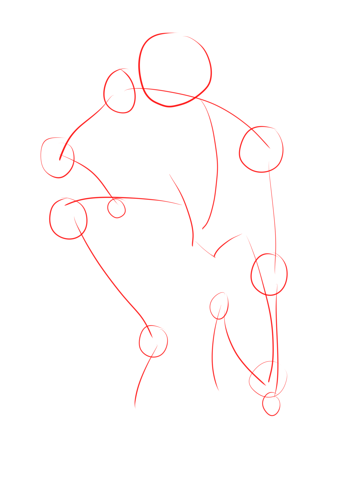
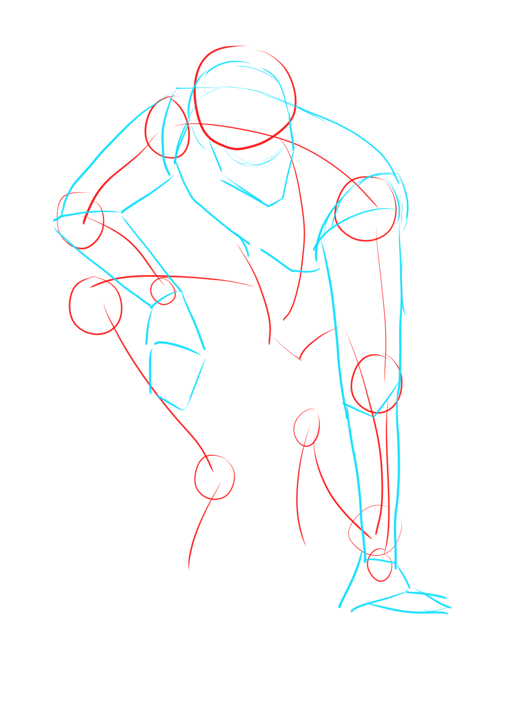
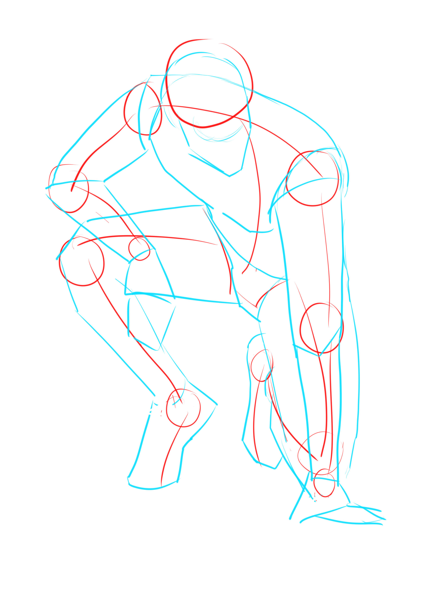
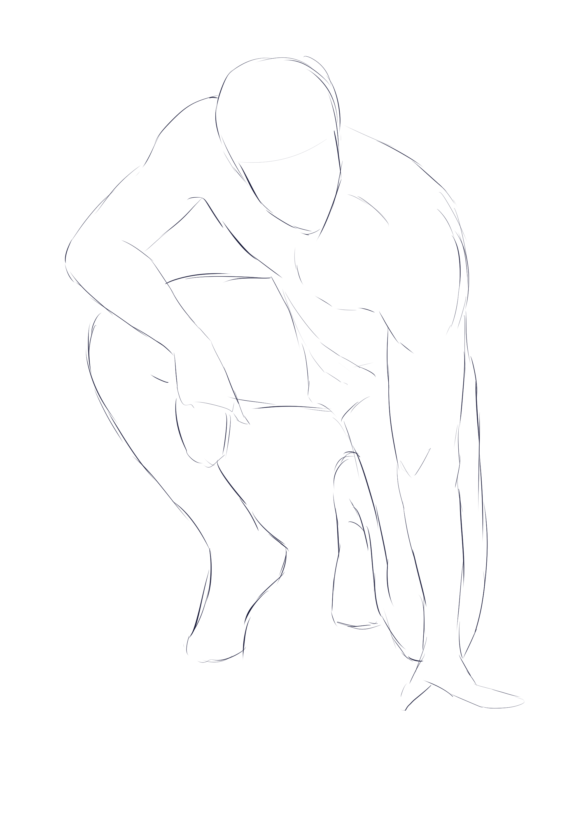
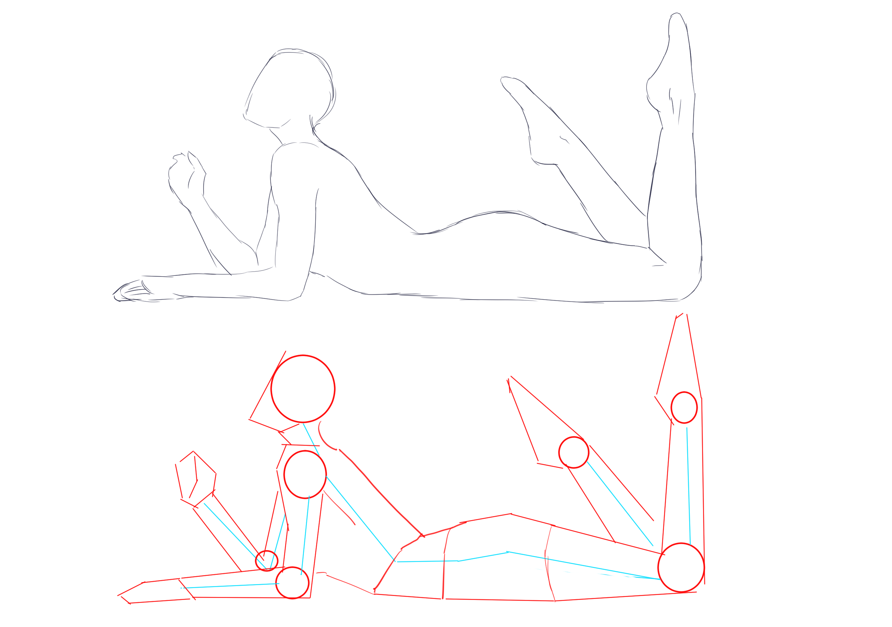
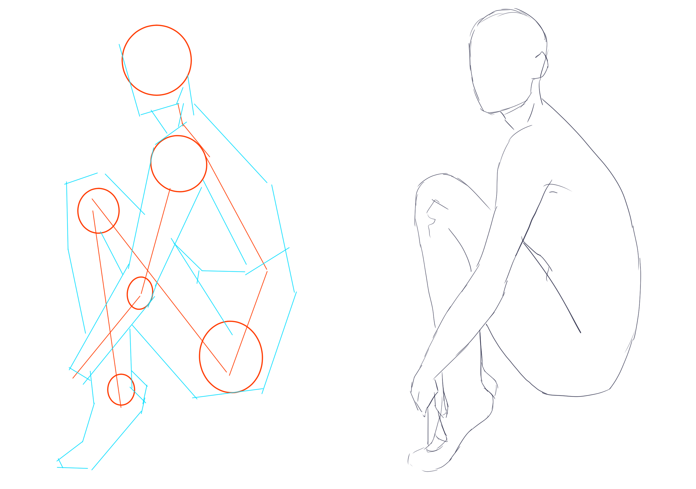

# CSP-07 · 复杂草图：按显著部位拆解，而不是一次画完整

## 何时读取

用于 1A–1B。姿势存在大幅弯曲、遮挡、坐蹲、交叉肢体或明显透视时读取。

## 连续讲解

复杂姿势首先确定最明显、最容易比较的部位。教程示例从背部和手臂开始，因为它们决定了姿势的主要弯曲和外部空间；腿部更复杂，因此留到主要结构成立之后。这个顺序不是固定身体顺序，而是“信息最清楚的部位优先”。

另一个复杂姿势也应先划分再连接。划分方法取决于姿势和目标效果，但不能省略各部分之间的尺度与遮挡核对。

## 模型执行

1. 列出姿势中最明显的两个部位和最难确认的一个部位。
2. 先画最明显部位的动作线、端点和体块。
3. 用它们建立躯干方向和遮挡。
4. 最后接入难确认的腿部或被遮挡部分。

## 检查问题

- 先画部分是否真正约束了后画部分？
- 遮挡是否有明确前后，而不是线条相撞？
- 后补的腿部是否仍连接到同一骨盆和重心？

