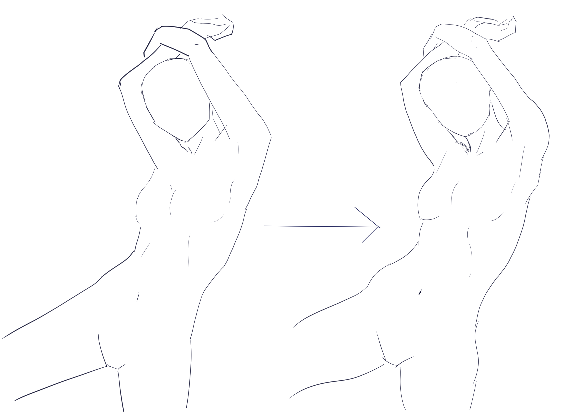
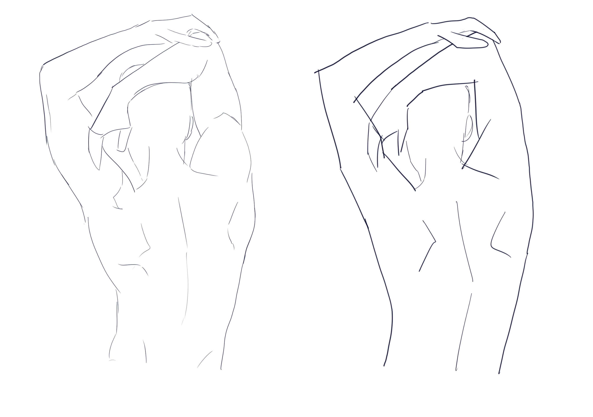

# CSP-08 · 细节：线条质量如何改变人体观感

## 何时读取

用于 1C 结构修稿和进入清线前。它不是 1A 起稿卡。

## 连续讲解

结构成立之后，再比较曲线数量、线条粗细、手臂流畅度、背部转折和肋部等细节。过早增加曲线会掩盖比例问题；完全等宽、犹豫或断续的线也会让身体显得僵硬。线条的力度和速度还能传达紧张、放松等姿态感觉。

## 模型执行

1. 先确认中线、关节和体块没有待修正的大偏差。
2. 比较长曲线是否流畅、转折是否有结构原因。
3. 主轮廓、内部结构和轻微细节使用不同轻重。
4. 删除重复试探线，但保留解释体积所需的转折。

## 检查问题

- 线宽变化是否服务于形体与遮挡？
- 曲线是否让身体更连贯，而非更软塌？
- “漂亮的线”有没有掩盖错误的肩、胯或关节位置？

