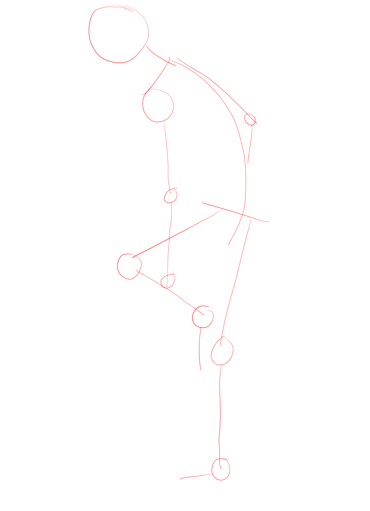
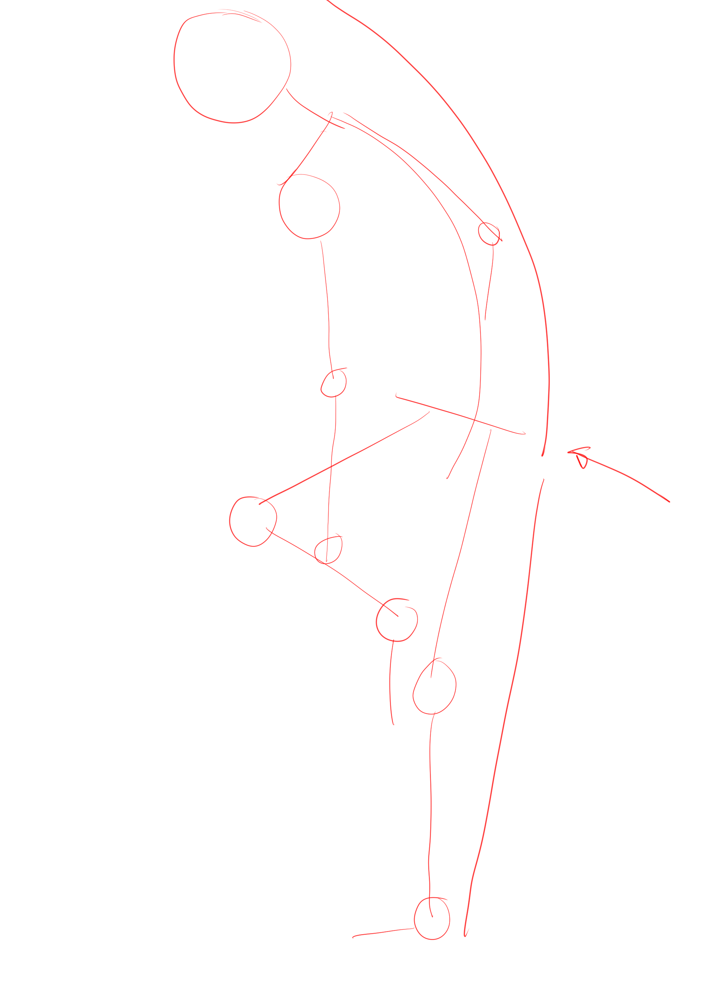
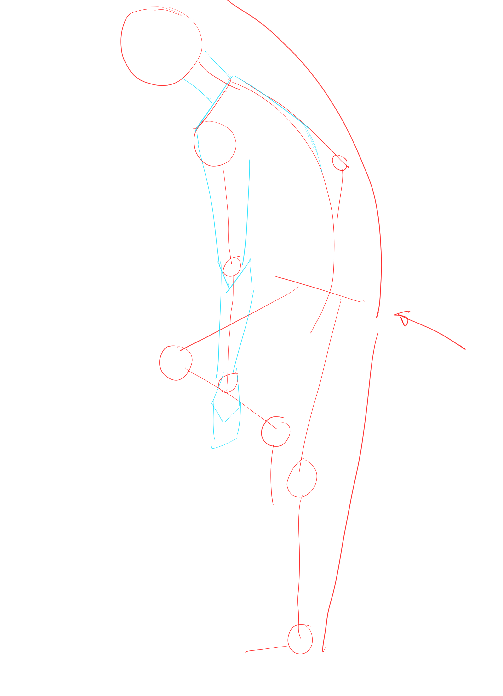
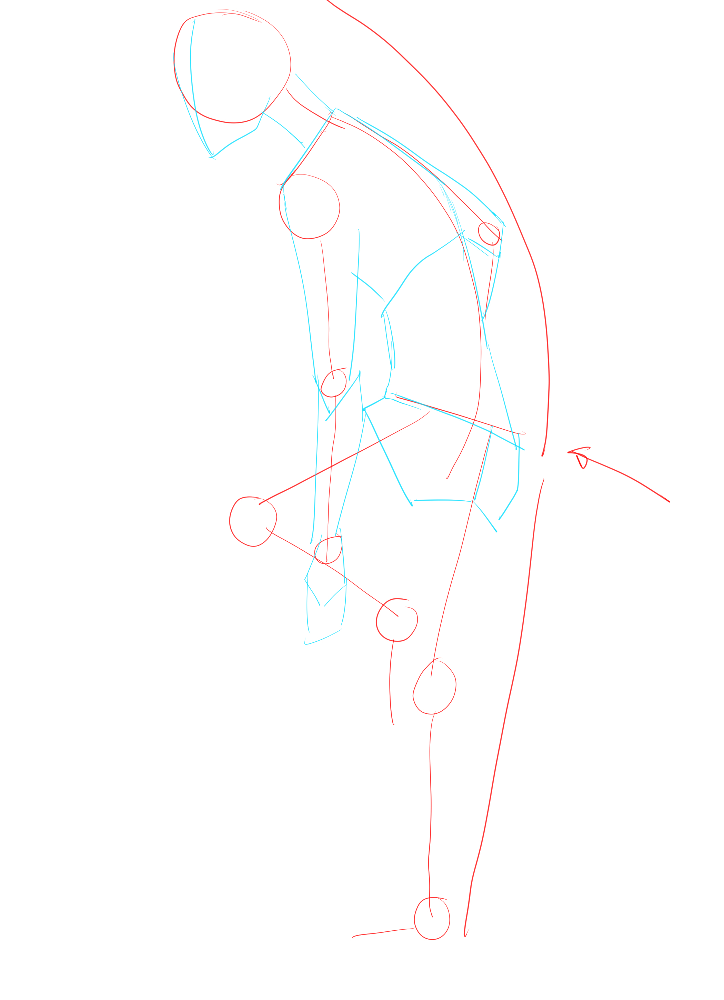
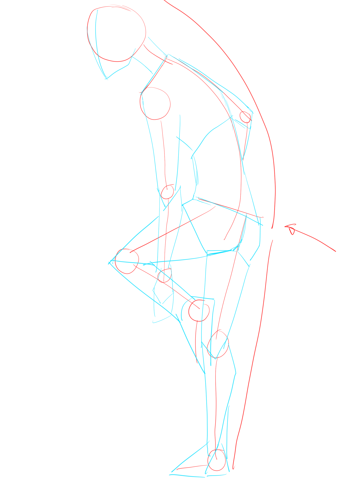
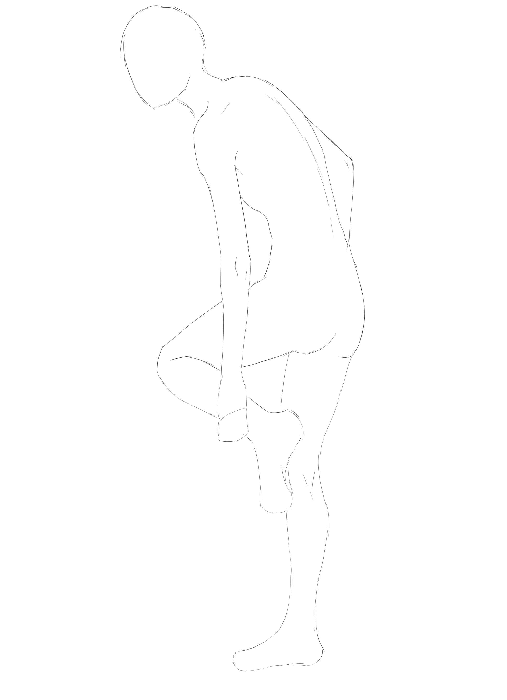

# CSP-09 · 草图总流程：从比例骨架到完整结果

## 何时读取

用于串联 1A、1B 和 1C；当模型知道零散技巧却不能稳定完成整个人体时读取。

## 连续讲解

先用圆圈标记肩、肘、腕、膝和踝。再比较头部到臀部、臀部到脚部两段总长度；教程以两段大致相近作为初始校验，但目标角色比例优先。实际落笔从画面中可见、容易确认的部分开始，然后进入躯干，最后连接腿部。

## 模型执行

1. CSP-01：比例中线与分界。
2. CSP-05：动作基线与关节点。
3. CSP-02：简单形状连接。
4. CSP-03 / CSP-04：分别确认上、下半身。
5. CSP-08：结构复核后处理线条质量。

## 完成标志

完整粗稿既能看出目标姿势，也保留可追溯的中线、关节点和体块依据；不能只剩一圈未经解释的外轮廓。

