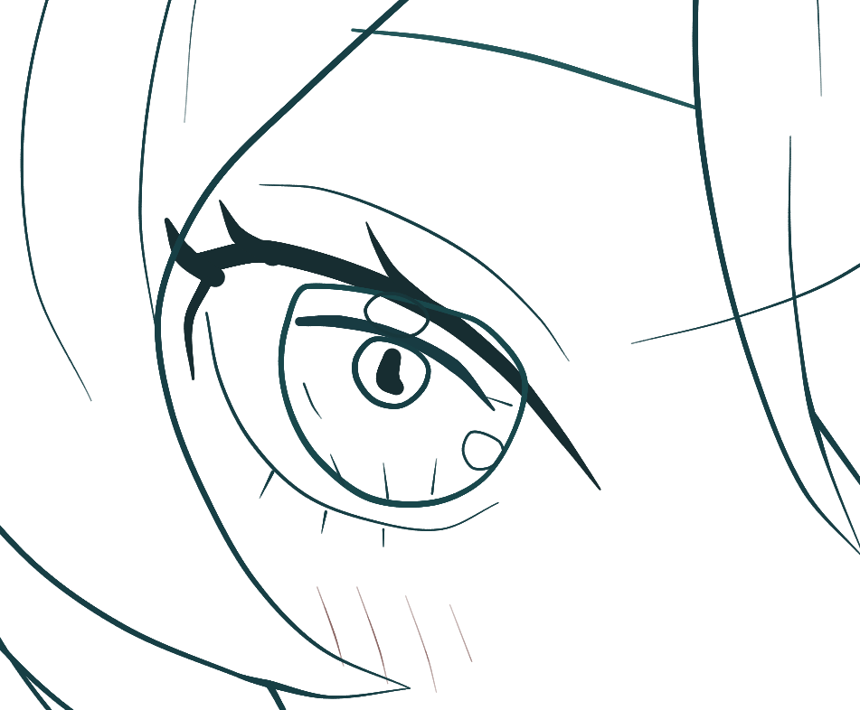

# R3 左眼真实试画

2026-09-07，使用实际网页绘画工具，在独立副本 `R3-left-eye-trial` 完成观察、取坐标、局部修线和实际图像复看。最终 revision 27，共 360 条笔迹；原 R3 文件未改。保留原七个检查点，并增加「左眼小组试画 · 实际复看完成」。

## 文件

- [可编辑工程](../studies/r3-left-eye-trial/R3-left-eye-trial.line.json)
- [实际会话记录](../studies/r3-left-eye-trial/session-evidence.json)：22 次调用、4 个修改组、7 张原始观察图；保留源几何，省略可重算的采样点。
- [文件与改动核对](../studies/r3-left-eye-trial/integrity.json)

## 实际调用与视觉反馈

会话 ID：`ddd0bf37-0e2b-49f2-b924-8f37b8cabea4`。下表的 call-N 和 group-N 均为该会话 ID 后的后缀，日志中保留完整 ID、参数、结果、时间和 revision。

| 调用 | 实际执行与结果 |
|---|---|
| call-1、2 | 取得状态及正式规范全文，复制作品标题；revision 24 → 25。读取的规范哈希为 `0cbc7e874255d46d743cd1e62bba2c61fa9e7771691ec68e4bc70f1538bd304a`。 |
| call-3、4 | 查看左眼参考、当前画面、隐藏底稿与整图位置；取得 66 条候选且没有剩余分页，再取 5 根目标笔迹的完整几何。 |
| call-5 / group-1 | 按已有透视、眼部体积、细稿与上眼睑坐标修订 4 根线，revision 25 → 26。保留上睑两端，微调弧顶，缩短并斜收睫毛。 |
| call-6 | 实际呈现修订后的四格图，发现中间短睫毛形成一根多余的小刺。 |
| call-7 / group-2 | 删除 `r3-clean-eyelash-left-mid`，revision 26 → 27。 |
| call-8、9、10 | 实际呈现完成后的左眼、双眼与脸部关系、整幅翻转图。上睑根部连续，中间小刺消失；头部倾斜与双眼关系保持。脸部调用只取 1 条坐标记录，用于扩大视觉回看范围，不把它当作完整坐标查询。 |
| call-11、12 | 记录左眼局部观察，保存试画检查点。没有给整幅 R3 重新签署两轮全局通过。 |
| call-13、14、15 | 查全量笔迹、列出检查点、取得左眼 29 条底稿 ID。call-13 的大响应在浏览器桥接时超时，应用完成执行并留有日志；该调用不作为视觉或绘画决策依据。 |
| call-16 / group-3 | 在副本中临时移除 29 条左眼底稿以构造无底稿情形；省略 basis 仍成功。 |
| call-17、18 / group-4、19 | 实际查看 `guideStatus: none-found` 的对照图；通过页面 JSON/API 入口提交一根短下睫毛，`guideIds: []`，说明按现有眼线和参考定位。工具接受并实际呈现落笔结果。 |
| call-20、21、22 | 记录无底稿试验后恢复试画检查点，并再次实际查看最终左眼。恢复图与 call-8 原图 SHA-256 完全一致。临时移除的底稿全部恢复，试验短睫毛已移除。 |

上述图片均通过图像工具实际呈现，归档 PNG 从本次调用输出中直接提取，逐一核对会话记录中的 SHA-256，没有另行生成替代证据图。日志关联只表示“该 revision 和区域可能包含这些组”，本身不证明模型看懂或美术质量合格。

## 可核对的坐标使用

group-1 的 basis 引用 `r3-layout-eye-perspective`、`r3-layout-eye-left-mass`、`r3-refine-eye-l-lid`、`r3-clean-eyelid-left-main`；这些 ID 在 call-3 / call-4 的实际结果中出现，日志保存对应读取调用 ID。

上眼睑沿用原清线的两个端点 `(366.847826, 618.478261)` 与 `(515.217391, 701.630435)`。弧顶附近 x=`389.673913` 的源点由 y=`615.217391` 改为 `613.7`，上移约 1.52 画布像素。参考细稿 x=`412.5` 的 y=`618.478261`，实际选择 y=`618.4`。眼部体积椭圆只作占位，未直接当作眼睑轮廓。

提交时按 `eye-l` 的对象框 `[339.130435, 566.304348, 226.630435, 171.195652]` 换算为局部坐标，工具保存源几何；坐标依据与实际改动可从日志相互核对。

最终仅修改 `r3-clean-eyelid-left-main`、`r3-clean-eyelash-left-up`、`r3-clean-eyelash-left-high`，删除 `r3-clean-eyelash-left-mid`。其他笔迹的源几何、图层、场景对象以及原检查点保持一致。

## 原始观察图

- [落笔前的参考／画面／底稿／整图](../studies/r3-left-eye-trial/before-context.png)
- [第一组修订后，仍有待删除小刺](../studies/r3-left-eye-trial/after-first-group.png)
- [最终脸部关系](../studies/r3-left-eye-trial/face-context.png)
- [最终整幅翻转图](../studies/r3-left-eye-trial/mirrored-overview.png)
- [无底稿情形](../studies/r3-left-eye-trial/no-guide-context.png)
- [无底稿仍实际落笔的结果](../studies/r3-left-eye-trial/no-guide-result.png)

这次验证证明小部位的“读到依据—实际改线—看结果再修订”流程能够完成，且两种接口都有记录。虹膜、高光和其他部位沿用旧稿；整幅作品仍需按正式规范重新观察和修订。下一步可将同一循环用于右眼及面部衔接，再逐部位推进全幅。

导出工程不含参考图像。会话附件中的对照 PNG 包含当时读取的参考局部。由于浏览器大体积完整导出超时，工程采用当前 compact 导出，原七个检查点从未改动的 R3 文件复制，第八个检查点的单独导出与当前工程逐字相同；这只是文件组装，不是重新作画。

程序验证：74 项测试通过，静态站点与 R3 单文件构建成功；原工程、参考图及历史执行记录没有差异。试画工程经导入校验及 compact 导出／再导入核对，保留 360 条笔迹和 8 个检查点。
