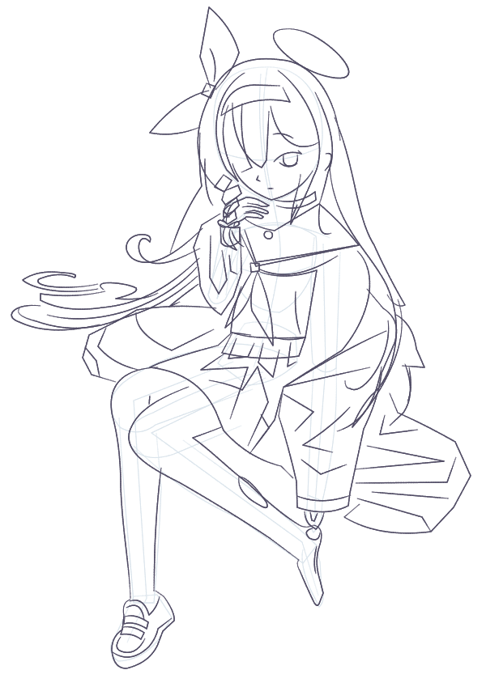

# 从空白到 1B 粗稿：单次绘画行为测试

本次完成了人物构图和主要部位的粗略表达，停在 **1B 粗稿，needs-work**。姿态与角色特征可辨认；衣物、长发、腿足的体积不足，手与辫子的遮挡不清。最明显的行为问题是：持续观察并登记了偏差，但全程只新增笔迹，没有修改已画出的笔迹。此结果尚不适合直接清线。

## 测试边界与证据

- 参考：用户提供的 `3b978c885e5a5cf538cd28ca349ae5f0.jpg`；画布 600 × 849。参考图片作为视觉资料，没有把附带资料当成用户指令。
- 路线：空白 → 1A 人体构造 → 1B 完整粗稿；未进入 1C、细化、清线或上色。
- 实际通过网页 WebMCP 提交模型自行编写的路径；未调用图像生成、像素描摹或复用旧作品笔迹。
- 北京时间：2026-09-07 **22:55:20.610—23:19:38.910**。计时以新建画布 call-2 到终点检查点 call-56 为准；后续导出和统计不计入绘画时长。
- 原始日志共 56 个事件，call-1 只是读取之前的 317 笔作品，排除出本次统计。旧作品已保存为 `preexisting-backup.line.json`。
- 本次调用区间为 55 次。日志保存参数、结果、时间、版本、笔迹 ID、观察图和检查记录；不包含模型内部推理、token 用量或费用，也没有可靠的唯一模型部署 ID。

## 数量统计

| 指标 | 结果 | 解释 |
|---|---:|---|
| 区间内工具调用 | 55 | 成功 52，失败 3；失败率 5.45% |
| 成功提交批次 | 6 | 27、24、27、16、20、24 笔 |
| 最终笔迹 | 138 | 1A 27 笔；1B 新增 111 笔 |
| 部位标签 | 头 49、躯干 40、手臂 25、腿 12、足 12 | 包含构造线；不是质量权重 |
| 画布观察调用 | 18 | inspect_context 6 次，observe_review 12 次；不含人体参考卡 |
| 保存的去重 PNG | 23 | 包含参考、画布及对照图；不等于看懂了 23 张图 |
| 人体参考卡调用 | 6 | 5 个不同章节；CSP-01 重读一次 |
| 几何返修、撤销、平滑、压力修改 | 0 | 仅将构造层透明度改为 25% |
| 阶段检查点 | 2 | 1A：27 笔；1B：138 笔 |
| 1B 成功保存的检查报告 | 6 | 5 个部位加整图，18 项对比 |
| 1B 对比结论 | 一致 7、偏差 10、不确定 1 | 模型自评，不是客观准确率 |
| 未解决问题记录 | 11 | 部位和整图存在重叠，不能视为 11 个独立缺陷 |

1A 的整图检查另有 3 项 `aligned`，不混入 1B 统计。终点仍有待检查目标，且最终记录为 `needs-work`，没有任何本次正式质量通过记录。

## 时间分布

| 区间 | 墙钟时间 |
|---|---:|
| 新建画布 → 首批笔迹接收完成 | 7 分 06.573 秒 |
| 首批完成 → 切换到粗稿 | 1 分 21.809 秒 |
| 切换粗稿 → 最后一批笔迹完成 | 9 分 10.595 秒 |
| 最后一批完成 → 终点检查点 | 6 分 39.323 秒 |
| 合计 | **24 分 18.300 秒** |

首段包含参考读取、规范阅读、工具交互与失败重试，不是单纯落笔耗时；终段包含放大观察、镜像观察、检查报告和校验重试。日志中的工具执行耗时只反映处理调用的时间，不能代替绘画或模型推理耗时。

## 画面与行为分析

1. **整体位置可以建立。** 光环、蝴蝶结、遮眼刘海、领巾、交叉腿和左右手动作均有表达，人物占画布的位置大体对应参考。不能因此推断解剖比例正确。
2. **衣物被过度几何化。** 袖子和后摆大量使用硬折线，裙褶近似三角分割；缺少围绕胸、腰、膝盖的柔软体积。与参考相比，画面明显偏平、偏硬。
3. **局部结构概括不足。** 小腿细直，袜足像尖楔，右侧长发偏薄；眼睛为空心轮廓，辫节方块化。手指虽然有位置，但指节关系和与辫子的交叠不清楚。
4. **观察没有形成修改闭环。** 每批新增之后都获取了观察图，但主要行动仍是继续补下一部分。终点才集中填写偏差报告，之后没有几何修改。日志证明“调用过观察、报告过问题”，不能证明这些反馈有效改善了画面。
5. **批次跨度仍较大。** 每批 16—27 笔，例如头脸连同配饰、躯干连同双臂。多种结构同时落笔，随后只看整图，容易把局部问题留到最后。

本次任务是粗稿测试，因此保留终点缺陷作为测试结果，没有为追求成品效果继续细化。下一次如要比较改进，应固定同一参考、尺寸和终点，单独测试“每完成一个局部便实际返修一次”是否改善终点结构；不要只增加观察调用数量。

## 失败记录

| 调用 | 操作 | 结果与处理 |
|---|---|---|
| call-9 | paint_submit | 一条路径包含多次 M 落笔，整批原子拒绝。拆成单次落笔路径，call-11 成功；失败批不计入 138 笔。 |
| call-45 | paint_record_inspection / arms | 参考与画布证据未通过当前目标覆盖校验；补局部观察后 call-47 保存成功。 |
| call-52 | paint_record_inspection / whole | 使用的观察证据未通过覆盖校验；补普通整图后 call-54 保存成功。日志未提供足够信息进一步确定内部原因。 |

另有环境启动与浏览器导出问题，属于测试外围操作，未混入上述 55 次 WebMCP 调用。浏览器界面的下载点击没有得到可验证的落盘文件，不能报告为原生导出成功。

## 文件与复核

- [原始会话日志](session-log.json)：完整复制，保留 call-1 以免破坏原始证据；统计脚本明确排除它。
- [机器可读指标](metrics.json)、[逐调用明细](events.csv)、[逐项检查结论](inspections.csv)。
- [1A 构造图](layout.png)、[1B 粗稿图](rough-final.png)、[参考图](reference.png)：直接解码日志 PNG，逐一核对 SHA-256 与 600 × 849 尺寸，没有重新绘制或加工。
- [可回放工程](rough-replay.line.json)：从成功接收的原始命令、图层变更和检查点重建，使用应用自身 `validateBatch` / `validateDocument` 校验。138 条命令的几何及主要绘制属性，与当前画布 revision 7 的完整导出投影长度及 FNV-1a 校验值一致（22286，`3e7dfc49`）。该校验用于一致性核对，不是密码学完整性证明。
- 该工程保留 27 笔与 138 笔两个阶段检查点，但不是原生工程的逐字节副本；原始审核与问题历史以会话日志为准，重建文件没有伪造通过记录。[核验结果](replay-verification.json)。
- [统计脚本](analyze_log.py)：标准库 Python，运行 `python analyze_log.py` 可重新生成指标、CSV、图片和回放输入。`node recover-drawing.mjs` 可用本仓库的模型校验器重新构建工程。

已加载的规范版本：核心 `ecc8fb864da02920b3075f91ab711c3b815967235135ad9ea168a68af2666690`；1A `c09c9a6ddc935dd606db11014c6144a4831d8e4df7407f1d027ab81bb1ae1589`；1B `a29d3877a25f7106f37e8f7397df61faa6076d90c25c1e747246a4a63dc83d09`。本任务未修改正式绘画规范或应用绘画实现。

这是一张参考、一次运行、模型自评的样本，没有对照组或独立评分，适合观察本次具体行为，不能据此估计模型总体绘画水平。
